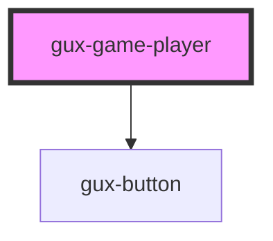

# web-player

<!-- Auto Generated Below -->

## Properties

| Property          | Attribute           | Description | Type     | Default |
| ----------------- | ------------------- | ----------- | -------- | ------- |
| `gameTitle`       | `game-title`        |             | `string` | `''`    |
| `source`          | `source`            |             | `string` | `''`    |
| `unityLoaderPath` | `unity-loader-path` |             | `string` | `''`    |

## Methods

### `onFullScreen() => Promise<void>`

#### Returns

Type: `Promise<void>`

### `onSendMessage(gameObject: any, method: any, param: any) => Promise<void>`

#### Returns

Type: `Promise<void>`

## Dependencies

### Depends on

- [gux-button](../gux-button)

### Graph

----------------------------------------------

*Built with [StencilJS](https://stenciljs.com/)*
